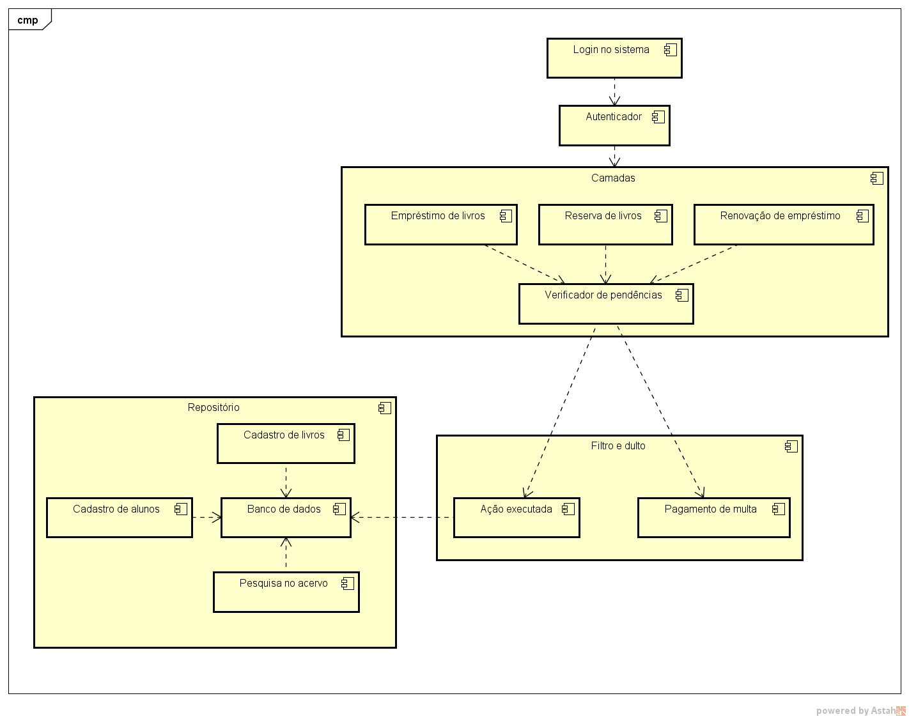
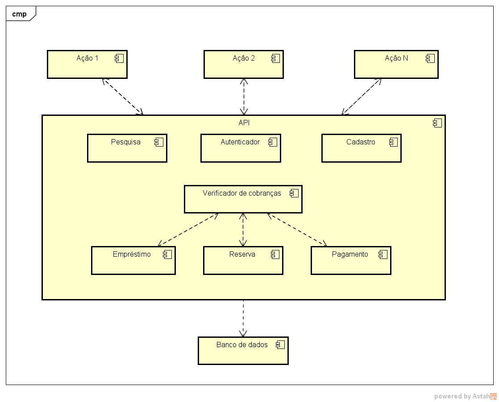

## Projeto de arquitetura projetada para a matéria de Engenharia de Software.

Sistema escolhido : **Biblioteca**.

### Tipos de arquiteturas usadas :

- Camadas
- Repositório
- Filtro e dulto

#### Definição das arquiteturas

> **Camadas**
- Nessa arquitetura o sistema é projetado para que uma solicitação do cliente seja feita de forma top-down ,ou seja, uma requisição chega no sistema e cada camada irá processar uma parte da requisição entregando para a camada abaixo o dado processado adaptado para a próxima camada. Assim cada camada fica responsável por parte do processamento do pedido do cliente para a funcionalidade que ele desejava fazer.

> **Repositório**
- Nessa arquitetura há um sistema central onde recebe requisição de vários subsistemas , ela possui os dados referentes a cada subsistema de um sistema maior, centralizando as informações gerais , assim tendo somente um local para recuperar/gravar as informações.

> **Filtro e dulto**
- Nessa arquitetura é feito uma divisão do tipo de informação recebida pelo sistema , separando cada tipo de artefato criado no sistema , e definindo , baseado nessa separação , como ele deve ser processado.

### Análise da Arquitetura 1

> **Componentes criados**

- Empréstimo de livros
- Cadastro de livros
- Cadastro de alunos
- Reserva de livros
- Pesquisa no acervo
- Renovação de empréstimos
- Verificador de pendências

> **Especificação**

**Foram usados 3 tipos de arquitetura para mostrar o projeto:**

#### Camada

Nessa parte é onde o usuário entraria no sistema para realizar as funções mais básicas:

> **Subsistemas integrados**

- Empréstimo de livros
- Reserva de livros
- Renovação de empréstimos
- Verificador de pendências

> **Motivo da escolha**

Foi adotado o de camada pois um requisito implícito para a conclusão dessas ações do usuário seria **Estar em dia com a biblioteca** , e para isso tem o componente : **Verificador de pendências** , que quando a requisição dos subsistemas desse módulo for feita necessariamente tem que passar por esse componente , para atestar que pré-requisitos por parte do usuário estão plenamente satisfeitos, assim usando o de camada pois necessariamente terá que passar por ele.

#### Filtro e dulto

Nessa camada seria para caso fosse a funcionalidade de **Reserva de livros** , **Reserva de livros** ou **Renovação de empréstimos** fosse requisitada ai passaria pelo **Verificador de pendência** e assim determinar o fluxo que os dados poderão seguir: Seguir o fluxo normal ou em caso de atestado que o usuário está com pendência solicitar que ele pague.

> **Subsistemas integrados**

- Verificador de pendências

> **Motivo da escolha**

Nessa fase há uma verificação da forma como a requisição deve ser tratada ( se pode concluir ou passar para a parte de pagamento de multas ) , por isso foi colocado uma arquitetura que "filtre" o tipo da requisição enviando para o subsistema especializado.

#### Repositório

Nessa parte da arquitetura seria o final das funcionalidades que o usuário iniciou ou ações que dependem só de banco de dados. Aqui ficaria um sistema de banco de dados que integraria todos os dados gerados pela aplicaçao, deixando um ponto central de acesso e gravação de dados da aplicação.

> **Subsistemas integrados**

- Cadastro de livros
- Cadastro de alunos
- Pesquisa no acervo

> **Motivo da escolha**

Deixar um ponto central na aplicação para gravação e recuperação de informações. Integrando cada subsistema da aplicação como um todo.

### Análise de Arquitetura 2

> **Componentes criados**

- Pesquisa 
- Autenticador
- Cadastro
- Empréstimo
- Reserva
- Pagamento
- Verificador de cobrança

Nessa arquitetura foi utilizada a forma de **Repositório** onde centralizaria todo o processamento do sistema, com isso pensei em uma espécie de **__API__** recebendo as requisições e processando-as , após isso pessando os resultados para o banco de dados.

Dentro dessa arquitetura alguns módulos "conversariam" como o de **Verificador de Cobrança** e os de **Empréstimo** e **Reserva** .